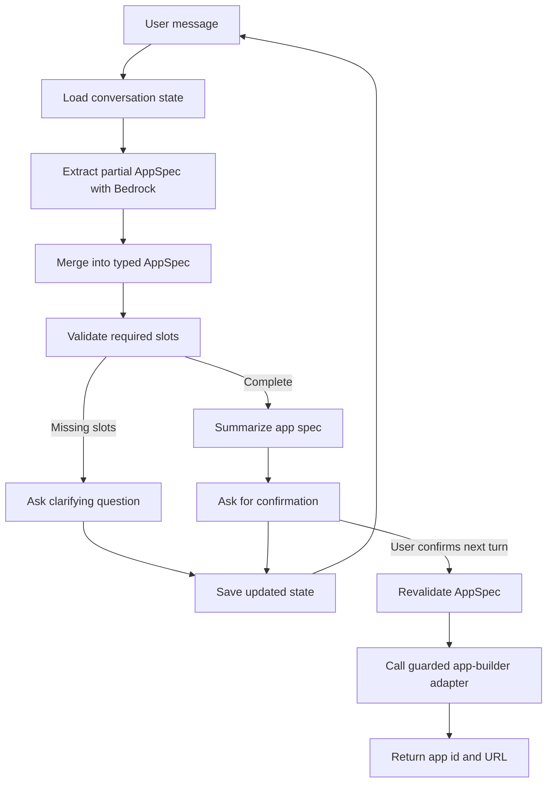

# AI Chatbot v2

TypeScript app-building chatbot that gathers requirements, asks clarifying questions, confirms the final app spec, and then calls a guarded app-builder adapter.

The first implementation uses Amazon Bedrock through the AWS SDK credential chain and local AWS SSO login. It does not use LangChain or LangGraph.

## Slot-Filling Chatbot Concept

This project treats app creation as a slot-filling workflow. Instead of letting the LLM freely decide when an app is ready to build, the backend keeps a typed `AppSpec` and fills it over multiple chat turns.

Each slot is a structured requirement the app builder needs, such as:

- `appType`: dashboard, workflow, CRUD app, chatbot, portal, or other
- `purpose`: what business problem the app solves
- `targetUsers`: who will use the app
- `coreFeatures`: the capabilities the app must provide
- `dataEntities`: the records or objects the app needs to manage
- `authRequired`: whether access control is required for templates that need that decision

On every message, the chatbot extracts only the requirements supported by the user's latest message, merges those values into the existing conversation state, validates which required slots are still missing, and asks focused follow-up questions. When all required slots are present, it summarizes the interpreted app spec and waits for explicit confirmation before calling the app builder.



The important design choice is that the LLM helps with language tasks, while application code owns the workflow rules.

| LLM responsibility | Application responsibility |
| --- | --- |
| Extract possible requirements from natural language | Define the `AppSpec` schema |
| Phrase concise clarifying questions | Decide which fields are required |
| Summarize the completed plan for confirmation | Merge, validate, and persist state |
| Classify ambiguous confirmation replies | Prevent app creation until validation and confirmation pass |

This keeps the implementation transparent and testable. The chatbot can be conversational, but the final app-builder request always comes from validated structured state rather than raw chat history.

## Prerequisites

- Node.js 20+
- npm
- AWS CLI configured for SSO
- Amazon Bedrock model access in `us-east-1`

## Setup

```bash
npm install
cp .env.example .env
aws sso login
```

The default model is:

```text
us.anthropic.claude-haiku-4-5-20251001-v1:0
```

## Run

```bash
npm run dev
```

Open `http://localhost:3000` for the minimalist local UI.

## API

```http
POST /api/chat
Content-Type: application/json

{
	"conversationId": "conv_123",
	"userId": "local-user",
	"message": "Build me a sales app."
}
```

## Scripts

- `npm run dev` starts the Fastify service with `tsx`.
- `npm run build` compiles TypeScript and copies the UI assets.
- `npm run start` runs the compiled service.
- `npm run test` runs the Vitest suite.
- `npm run typecheck` runs TypeScript validation.
- `npm run lint` runs ESLint.

## Current Scope

- In-memory conversation state.
- Bedrock Converse API adapter.
- Zod-validated app spec and state schemas.
- Deterministic required-field validation.
- Mock app-builder adapter that records create requests.
- Minimal local web UI for manual testing.